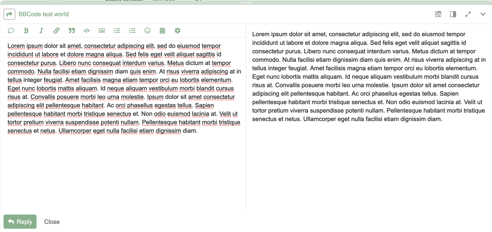

# Editor Preview Position

Allows the user to reposition and resize the preview in the composer for Discourse.

For more information, please see: [Editor Preview Position - Discourse Meta](https://meta.discourse.org/t/editor-preview-position/309934)


Also adds the option to style the composer in the same style as the fullscreen view.


## Settings

### Top Bar Preview Button

Moves the preview button to the top bar. Default: `true`

<details>
<summary>Screenshots</summary>


</details>

### Allow Top Bottom Previews

Allows the preview to be position above/below the editor. Default: `true`

<details>
<summary>Screenshots</summary>


</details>

### Allow Resizable Horizontal Previews

Allow the previews to be resizable along the horizontal axis. Default: `true`

### Allow Resizable Vertical Previews

Allow the previews to be resizable along the vertical axis. Default: `true`

### Clean Composer Style

Alters the composer style to more closely match the fullscreen composer style. Default: `false`

<details>
<summary>Screenshots</summary>




</details>

## Compatibility

Only works in Discourse v3.2.0 and above due to usage of `api.renderInOutlet()` function and new glimmer components.

## Local Development

For a guide to local theme, see [Discourse Theme CLI](https://meta.discourse.org/t/install-the-discourse-theme-cli-console-app-to-help-you-build-themes/82950) or the [Starter Guide](https://meta.discourse.org/t/get-started-with-theme-creator-and-the-theme-cli/108444).

```bash
discourse_theme watch ./
```
